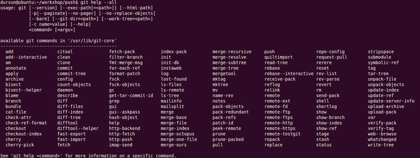

# Git 101  

.fx: first

Dursun Can TURAN `<dursunturan@gmail.com>`

[Git Sunumlarım](http://www.dursunturan.com/git) (http://www.dursunturan.com/git)

Temmuz 2012

---

# Giriş: Bir VCS olarak Git

---

# VCS (Versiyon Kontrol Sistemi) Nedir?

- Geliştiricilerin birlikte bir düzen içinde çalışmasını sağlayan ve bu çalışmaların kaydını tutan sistemlere denir.
- Temel işlevleri: Ortak Çalışma, Takip etme, Geçmişi Kaydetme, Yedekleme

---

# Git Nedir?

- Dağıtık bir VCS'tir. Yani Git'te tüm geliştiriciler aynı zamanda hem sunucu hem istemcidir.

---

# Avantajları
+ Dağıtık yapısı sayesinde iş akış modellemede çeşitlilikler sunabilmesi
+ VCSlere getirdiği farklı yaklaşım ve yenilikler
+ Muazzam bir kullanıcı topluluğuna sahip olması
	- Hosting servisleri: GitHub, Repo.or.cz, Gitorious, ... 
+ Çok hızlı ve hafif olması
+ Branchları birleştirmedeki başarısı
	- Örn. Len Brown tarafından Linux kernel projesinde tek committe 12 commit merge
+ Az alan kullanımı – Yüksek performans

---

# Avantajları

+ Araç çeşitliliği ve araç yazımının kolaylığı
+ (Özellikle SVN'den) Kolay migrasyon
+ Birden çok protokolü desteklemesi
	- git, http(s), ssh, rsync, dosya sistemi
+ 50.000 satırdan fazla dökümantasyon ve sorularınızı cevaplayacak birilerini bulma kolaylığı
	- git help <komut>, git help --all, git <komut> --help, man git-<komut>

---

# Git Tarihçe

---

# Kullananlar

+ Firmalar:
	- Google, Facebook, LinkedIn, Twitter, ...
+ Projeler:
	- Linux, Android
	- Qt, GNOME, KDE, X.org, Compiz
	- Perl 5, Ruby on Rails
	- Samba, PostgreSQL ve dahası ...

---

# İlk Adımlar: Kurulum ve Ayarlar

---

# Kurulum

UNIX türevleri, Linux için:

+ “git” paketi ya da resmi adresten; http://git-scm.com/

Windows için:

+ msysgit : http://code.google.com/p/msysgit/
+ TortoiseGit : http://code.google.com/p/tortoisegit/

Mac OS X için:

+ http://code.google.com/p/git-osx-installer/

Android için:

+ Agit : Android Market'ten temin edebilirsiniz.

---

# Git'i Ayarlamak

`git config <file-option> <args> <key> <value>`

+ Sisteme özgü: --system -> /etc/gitconfig
+ Kullanıcıya özgü: --global -> ~/.gitconfig
+ Depoya özgü: varsayılan -> $GIT_DIR/config ($GIT_DIR: “.git”)

Argümanlar:

	-f / --file <ayardosyasınınyeri>
	-l / --list
	-e / --edit
	--unset <key>
---

# Temel Ayarlar

`$ git config user.name "Dursun Can TURAN"`

`$ git config user.email dursunturan@yh.com.tr`

`$ git config --global core.editor vim`

`$ git config --global color.ui auto`

En çok kullanılan "key"ler:

+ user
	- name, email, signingkey
+ core
	- editor, pager, autocrlf, bare
+ color
	- ui
+ merge
	- tool, conflictstyle

---

# Komutları Kısalaştırmak (Alias atama)

Çok sık kullandığınız uzun komutlar olabilir ve her seferinde bunları yazmak size bıkkınlık getirebilir.

Bu uzun komutları kısalaştırmak için **alias** oluşturabiliriz. Şöyle ki:

`$ git config --global alias.<takmaad> <komut>`

Örneğin;

`$ git config --global alias.trh 'log --pretty=oneline --abbrev-commit --graph --decorate'`

Bu sayede her seferinde 

`$ git log --pretty=oneline --abbrev-commit --graph --decorate` 

yazmazsınız.

---

# Ve "Git"iyoruz ...

---

# Başka bir depoyu edinmek

`$ git clone git://github.com/git/git.git git-scm`

	Cloning into git-scm...
	remote: Counting objects: 136623, done.
	remote: Compressing objects: 100% (45621/45621), done.
	remote: Total 136623 (delta 99572), reused 124216 (delta 89119)
	Receiving objects: 100% (136623/136623), 30.06 MiB | 788 KiB/s, done.
	Resolving deltas: 100% (99572/99572), done.
 
---

# Depoyu incelemek

Temel olarak bir depoda Git araçlarıyla şunları inceleyebiliriz:

+ Tarihçe
+ Branch(lar)
+ Tag(ler)
+ Remote(lar)
+ İçerik (yani dosyalar, dizinler)

Öncelikli olarak tarihçeyi inceleyerek işe başlayalım.

---

# Tarihçeyi incelemek

Bunun için birden çok aracımız mevcut:

+ log : Geçmişte neler yaptığımızı gösteren temel aracımız

	$ git log --pretty=<biçim> [-p | -S “ara” | --stat] [-n <sayı> | --since | --until | --author | ...] commitish..commitish -- dosya

+ blame : Dosyada kim, neleri değiştirmiş

	$ git blame -M / -C -C / -L [ilk,son | ilk,bağıl | ”aranacak”,bağıl] [dosya | commitish -- dosya]

+ whatchanged : Yapılan değişiklikleri commitlerle birlikte gösterir

	$ git whatchanged

+ shortlog : Geçmişin özetini verir

	$ git shortlog

---

# Biraz önce klonladığımız Git deposunun tarihçesini inceleyelim

---

# Branch Nedir?

Tüm bir yazılım geliştirme sürecinin alt süreçleridir.

Örneğin Git deposunun süreçleri şu şekilde bölünmüş durumdadır:

	git-scm$ git branch -r
  	origin/HEAD -> origin/master
  	origin/maint
  	origin/master
  	origin/next
  	origin/pu
  	origin/todo

---

