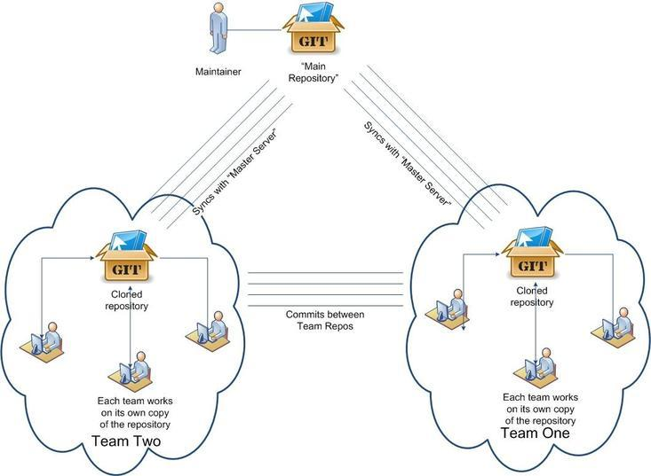
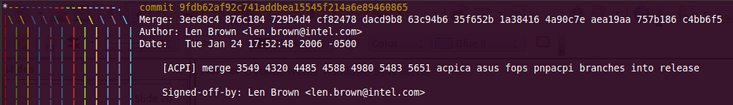
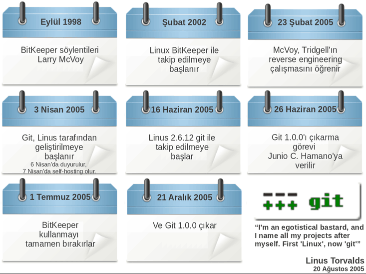

# Git 101  

.fx: first

Dursun Can TURAN `<dursunturan@gmail.com>`

[Git Sunumlarım](http://www.dursunturan.com/git) (http://www.dursunturan.com/git)

Temmuz 2012

---

# Giriş: Bir VCS olarak Git

---

# VCS (Versiyon Kontrol Sistemi) Nedir?

- Geliştiricilerin birlikte bir düzen içinde çalışmasını sağlayan ve bu çalışmaların kaydını tutan sistemlere denir.
- Temel işlevleri: Ortak Çalışma, Takip etme, Geçmişi Kaydetme, Yedekleme

---

# Git Nedir?

- Dağıtık bir VCS'tir. Yani Git'te tüm geliştiriciler aynı zamanda hem sunucu hem istemcidir.

---

# Avantajları
	+ Dağıtık yapısı sayesinde iş akış modellemede çeşitlilikler sunabilmesi
	+ VCSlere getirdiği farklı yaklaşım ve yenilikler
	+ Muazzam bir kullanıcı topluluğuna sahip olması
		- Hosting servisleri: GitHub, Repo.or.cz, Gitorious, ... 
	+ Çok hızlı ve hafif olması
	+ Branchları birleştirmedeki başarısı
		- Örn. Len Brown tarafından Linux kernel projesinde tek committe 12 commit merge
	+ Az alan kullanımı – Yüksek performans
	+ Araç çeşitliliği ve araç yazımının kolaylığı
	+ (Özellikle SVN'den) Kolay migrasyon
	+ 50.000 satırdan fazla dökümantasyon ve sorularınızı cevaplayacak birilerini bulma kolaylığı
		- git help <komut>, git help --all, git <komut> --help, man git-<komut>
	+ Birden çok protokolü desteklemesi
		- git, http(s), ssh, rsync, dosya sistemi

---

# Git Tarihçe

---

# Kullananlar

+ Firmalar:
	- Google, Facebook, LinkedIn, Twitter, ...
+ Projeler:
	- Linux, Android
	- Qt, GNOME, KDE, X.org, Compiz
	- Perl 5, Ruby on Rails
	- Samba, PostgreSQL ve dahası ...

---

# İlk Adımlar: Kurulum ve Ayarlar

---

# Kurulum

UNIX türevleri, Linux için:

+ “git” paketi ya da resmi adresten; http://git-scm.com/

Windows için:

+ msysgit : http://code.google.com/p/msysgit/
+ TortoiseGit : http://code.google.com/p/tortoisegit/

Mac OS X için:

+ http://code.google.com/p/git-osx-installer/

Android için:

+ Agit : Android Market'ten temin edebilirsiniz.

---

# Ayarlar

	$ git config user.name "Dursun Can TURAN"

	$ git config user.email dursunturan@yh.com.tr

	$ git config --global core.editor vim
	
	$ git config --global color.ui auto

